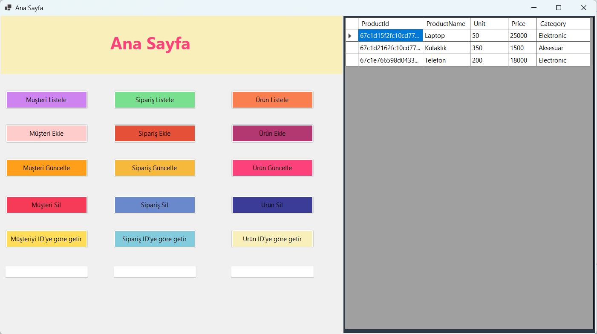
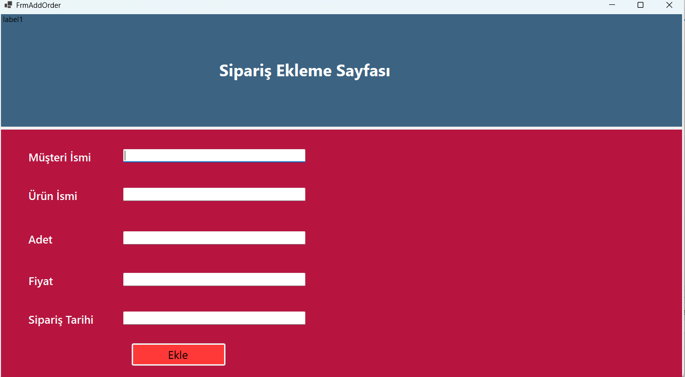
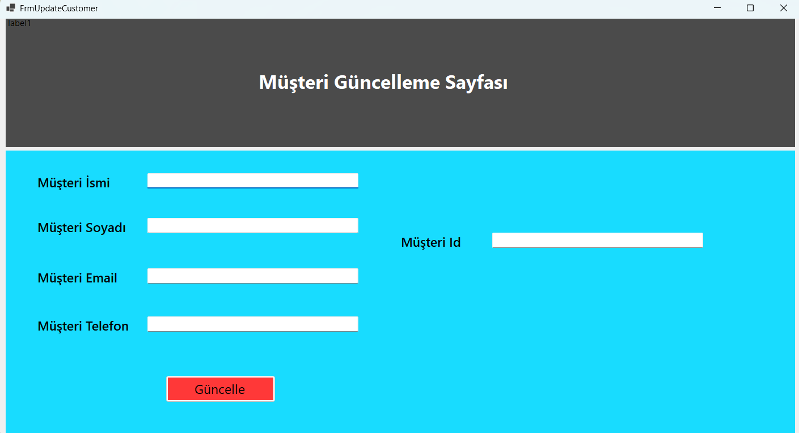

# 🚀 TechShopProject

- 🛍️ **TechShopProject**, Windows Forms tabanlı bir masaüstü uygulamasıdır.
- 📦 Kullanıcıların ürünleri,müşterileri,siparişleri listeleyebildiği, arayabildiği ve yönetebildiği bir sistemdir.
- 💾 ***MongoDB*** ile veri saklama işlemleri gerçekleştirilmiştir.

---

## 🛠 Kullanılan Teknolojiler

1. **Windows Forms:** Masaüstü arayüzü için.
2. **DTO (Data Transfer Object):** Veriyi taşımak için.
3. **MongoDB:** NoSQL veritabanı:

---

## 📌 Özellikler

- ✅ Ürün,sipariş,müşteri Listeleme 📝.
- ✅ Ürün,sipariş,müşteri Ekleme ➕.
- ✅ Ürün,sipariş,müşteri Güncelleme ✏️.
- ✅ Ürün,sipariş,müşteri Silme ❌.
- ✅ *MongoDB* ile Veritabanı Yönetimi 🗄.

---

## 📸 Ekran Görüntüleri

